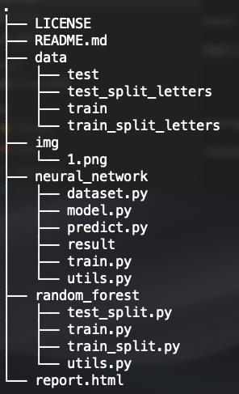

Captcha Recognition
---

- **目標**
  - 建立辨認度高，適應性強（適用於各種驗證碼）的強韌模型。
  - 比較傳統方法（Random Forest）跟神經網路（CNN）的模型。
- **說明**
  - 參考[Captcha Recognition Report](report.html)。
- **檔案架構**
  
  - `data`
    - `train`：儲存training data。
    - `test`：儲存testing data。
    - `train_split_letters`：儲存`train`前處理並切分後的字母數據。
    - `test_split_letters`：儲存`test`前處理並切分後的字母數據。
  - `neural_network`
    - `result`：儲存訓練好的模型。
    - `predict.py`：讀取`result`的模型，並使用testing data測試。
    - `train.py`：讀取、前處理數據，並建構、訓練、儲存模型。
    - 其餘皆是`train.py`的import。
  - `random_forest`
    - `train_split.py`：前處理並切分`data/train`。
    - `test_split.py`：前處理並切分`data/test`。
    - `train.py`：讀取數據，訓練模型，並使用`test_split_letters`測試。