## 2021(2022?) Introduction to Machine Learning Final Project

##### 學號：0816059
##### 姓名：王行悌

---

報告中將不會直接貼上程式碼，但皆會附屬在目錄下，並說明檔案架構中，各個檔案的功用。

---
- 主題：Captcha驗證碼辨識
---
- 動機：
  - 從以前到現在一直有在研究爬蟲，也接過一些案子，在手邊沒有可靠的ip池的狀況下，難免會需要處理驗證碼問題，而網路上普遍開源的reCaptcha表現都很差，而像是google開發的tesseract-ocr一類的辨識工具，拿來做驗證碼辨識，在前處理不到位的狀況下，往往也只有不到10%的辨識率，因此想藉此機會建立一個驗證碼辨識的模板，方便自己未來爬蟲需要使用。
---
- 資料集：
  - 因為之前有爬取sougou微信的需求，所以原本是打算使用sougou驗證碼做訓練，但礙於傳統方法比較難處理文字交叉的狀況，所以最後改用java的captcha庫產生的驗證碼做資料集。
  - 資料集一共11000則驗證碼，尺寸皆為80×26，驗證碼皆為4碼，包含英文大寫與數字。(這也是一般驗證碼常使用的尺寸與符號)。
---
- 資料可視化：

  
  - 使用隨機生成的驗證碼，因此不同符號間的出現頻率相同。
  - 因為是影像辨識的主題，不太需要分析feature間的相關性，或是降維等處理，故不做沒有意義的資料視覺化。
--- 
- 資料前處理：
  - 以下依序列出我對圖片的處理流程及原因，並以一張圖為例，直觀顯示每一步驟的成效
  1. 未經處理的原圖

     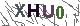
  2. 轉成灰度圖：圖片顏色基本不影響辨識

     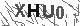
  3. 轉成二值圖：圖片內待辨識的文字顏色不會太淡，但可能存在顏色較淡的雜訊，因此設定閥值，轉換成非黑即白的二值圖，可以去除部分雜訊

     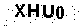
  4. 去除孤立點：文字基本都是連續的圖形，不會出現孤立的像素點

     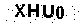
  5. 去除鄰近點少的點：概念近似於孤立點，文字的像素分布密集，在一個點附近的點數如果較少，更有可能是雜訊

     
  - 上面為了顯示前處理的意義，選了一個表現相對好的圖片，事實上因為閥值的設定，有時也會無法去除雜訊，或是去除部分的文字內容。

    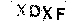
  - 在切片完後，重新將大小不同的切片統一resize成(10, 26)，再轉成特徵值，即可用來訓練。
---
- 模型：Random Forest
  - 檔案架構說明

    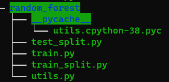
    - `__pycache__`：python執行時儲存連接的庫的快取
    - `utils.py`：存放一些公用的函數，如前處理、字串與數值轉換等
    - `train.py`：訓練model，並顯示在testing data結果
    - `train_split.py`：切割training data成單一字元
    - `test_split.py`：切割testing data成單一字元
  - 進一步的前處理：由於傳統的機器學習方法並不好處理圖片，因此需要轉換成特徵值
    - 在原本的前處理後，我透過判定連續像素點為字元，將圖片分割為四個字元。
    - 具體判定方法為，若整行皆為白色像素點，則當成不連續，獲取若干個切片後，保留間距最大的四個切片。
    - 如下圖，便為training data中G字元的分割。

      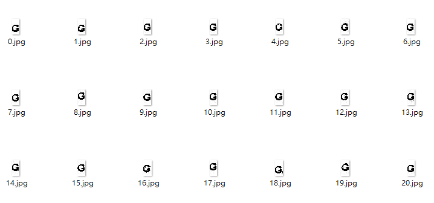
  - Random Forest超參數：
    - 一開始沒有限制Random Forest，導致過擬合。
    - 後續透過限制深度，以及葉子節點內最小樣本數量解決此問題。
  - 結果分析
    - 圖形中`Letter Acc`泛指辨識字元的正確率，`Code Acc`代表整個驗證碼的正確率。

      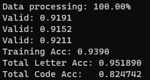
    - train data
      - 訓練時為了評估model，因此採用cross validation的方式訓練與測試，等獲取較好結果後，再用全部資料訓練。
      - 如上圖，在使用三分之一數據訓練時，有91%-92%的準確度，而使用全部數據訓練，則可達到93.9%。
    - test data
      - 在辨識單一字元上，有95.1%的準確率。
      - 在辨識整個驗證碼上，可達到82.4%的準確率，基本已經接近人的表現。
    - 透過confusion matrix可發現，錯誤率最高的字元為I(21%)、W(14%)，分析後發現，主要為切割問題造成，這幾個字元在切割時更有可能錯誤分割，因此導致預測時準確度較低。(以W字元為例)

      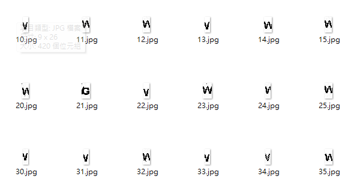
    - 由於confusion matrix維度過大，不在報告中附上，可執行`train.py`獲得。
---
- 模型：SVM/SVC
  - 檔案架構說明

    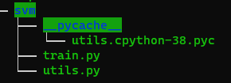
    - `__pycache__`：python執行時儲存連接的庫的快取
    - `utils.py`：存放一些公用的函數，如前處理、字串與數值轉換等
    - `train.py`：訓練model，並顯示在testing data結果
  - 這邊的前處理基本在Random Forest都處理完了，模型本身的性質也較不需用調參，因此不做贅述，單純比較性能。
  - 結果分析

    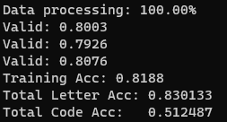
    - 使用了不同的kernel，表現不盡理想，速度更是比其他兩種方法都慢上許多。
    - 基本上無論是training data，或是testing data，辨認字元都只有80%左右的準確率，辨認整個驗證碼甚至只有50%的準確度。
    - 個人推測是SVM不適合作此種分割的緣故，本質上我產生的feature單一並沒有意義，而是彼此相連才建構出字元，而這恰好是SVM所不擅長的。
---
- 模型：神經網路
  - 檔案架構說明

    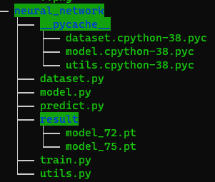
    - `__pycache__`：python執行時儲存連接的庫的快取
    - `result`：存放訓練完的model
    - `utils.py`：存放一些公用的函數，如前處理、字串與數值轉換等
    - `dataset.py`：pytorch的dataset
    - `model.py`：pytorch的model架構
    - `train.py`：訓練model，並將最好的結果儲存於`result`中
    - `predict.py`：存取計算完的model結果，並就testing data分析成效
  - model架構

    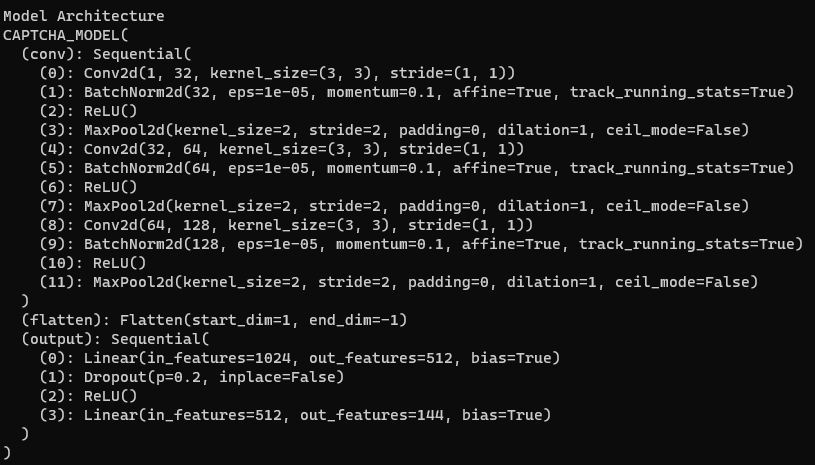
    - 三層卷積層：通道數(特徵數)逐步增加，是基於越後期特徵越具體的邏輯，事實上VGGNet跟Resnet也是這麼做的
    - 卷積層中的BatchNorm：使參數平滑，更容易訓練到深層的參數
    - 卷積層中的MaxPool：減少訊息冗餘，也降低model的大小，經過實驗，減少這一層不影響model的成效，但會增加model大小
    - 平攤層：在做完三層卷積後，將二維的結果平攤成一維，方便後續的全連接層
    - 兩層全連接層：將特徵數量逐步減少，並透過dropout，使訓練結果更為強健
  - learning rate：透過`torch.optim.lr_scheduler`調整訓練速度，避免前期訓練過慢，也避免後期來回震盪，無法降低loss
  - loss function：由於這是一個multi-head(有多個輸出)的問題，因此傳統的loss function未必適合，改用`nn.MultiLabelSoftMarginLoss`避免部分輸出成效極好，部分輸出被忽略
  - 結果分析
    - 以下`Letter Acc`泛指辨識字元的正確率，`Code Acc`代表整個驗證碼的正確率。
    - 作為對照，嘗試未經過前處理的圖片直接訓練，僅有20%上下的`Code Acc`。
    - train data
      - 在training set的表現極好，甚至超過人類的辨識準確度。

        
      - 由於confusion matrix除了辨認正確的一欄外幾乎都是0，因此不在報告中贅述，可透過執行`predict.py`得到。

    - test data
      - 在testing set上，單一字元辨識仍有95.5%的準確度，完整的驗證碼也有84.7%的準確度。

        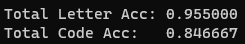
      - 進一步透過confusion matrix分析，可得出較容易辨認錯誤的字元。(由於confusion matrix較大，因此不直接印出，而是直接分析不為0的部分)
      - 下圖為各個字元的準確率，以及錯辨認成的字元，不難看出辨認錯誤率高的都是較為相似的字元，如6跟0、7跟T、K跟X、L跟I等。(透過confusion matrix求出)

        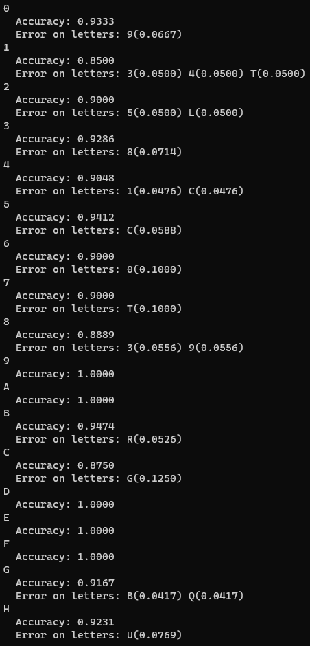
        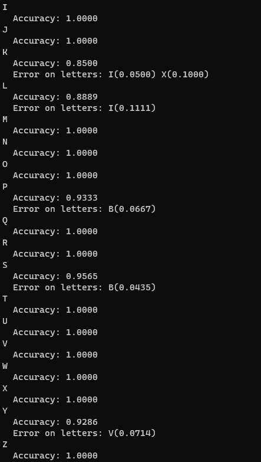
---
- 結果比較：
  - 準確率上，Random Forest跟神經網路表現較好，但考慮到在Random Forest還需要做特殊的前處理，神經網路明顯略勝一籌。而也因為錢處理的原因，Random Forest的錯誤率更多來自於前處理與文字分割，而神經網路的錯誤率更多來自超參數的調整。
  - 另外一個傳統模型SVM表現更差，推測即便前處理成特徵值後，SVM的模型性質依然不容易分割的緣故。
  - 泛用性上，神經網路在圖形辨識上明顯占優，傳統方法必須先將文字割開，再處理成特徵，才可以開始訓練，然而在更複雜的驗證碼中，切割文字並不容易。
---
- 未來方向：
  - 驗證碼的特性使得比起監督式學習，更適合半監督式學習的模式，我手邊有找到的部分標註過的sougou驗證碼，並透過爬蟲程式獲取更多的未標示的sougou驗證碼，之後應該會再考慮實現半監督式的神經網路模型。
  - 雖然由於硬體及時間限制，這次的模型並沒有花太久的時間調參(跟上次作業相較)，但我應該不會再繼續透過調參改善模型，因為驗證碼畢竟屬於實用導向，當準確率達一定水準後，最多就是多試個兩三次便可通過驗證，我認為追求更高的準確度沒有實質意義。
---
- 最後的最後，放張最近在追的Vivy鎮樓，結束這學期。

  